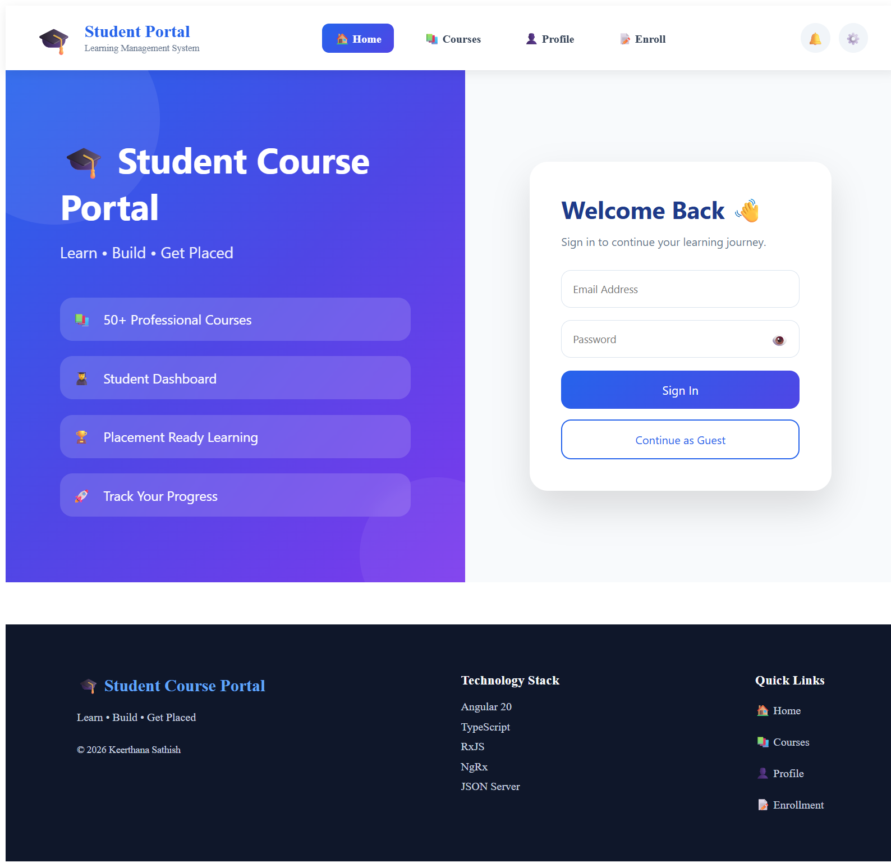
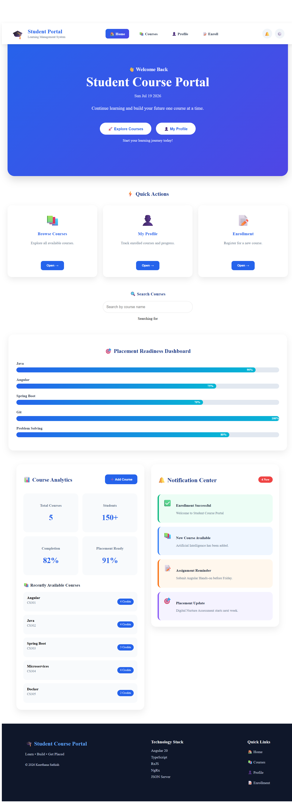
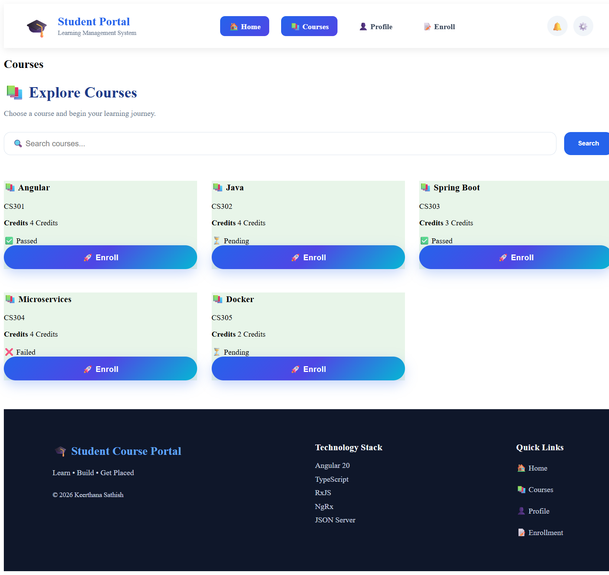
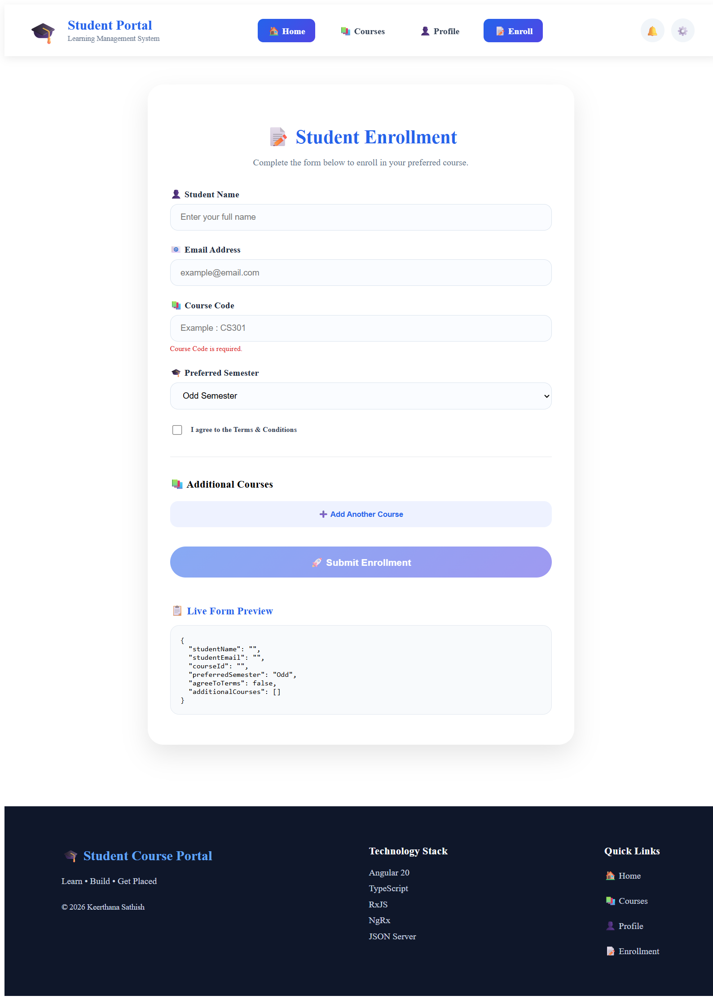
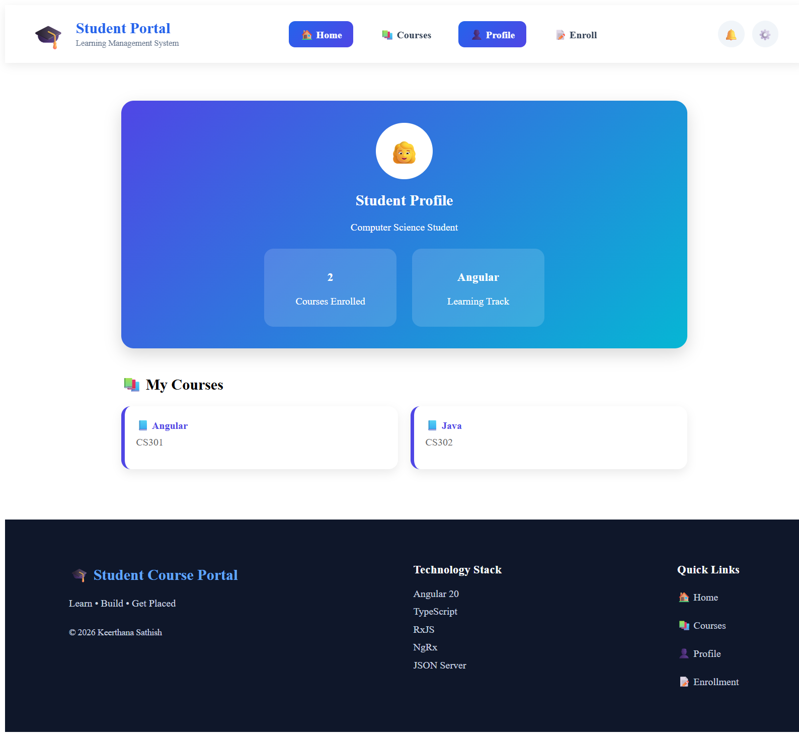
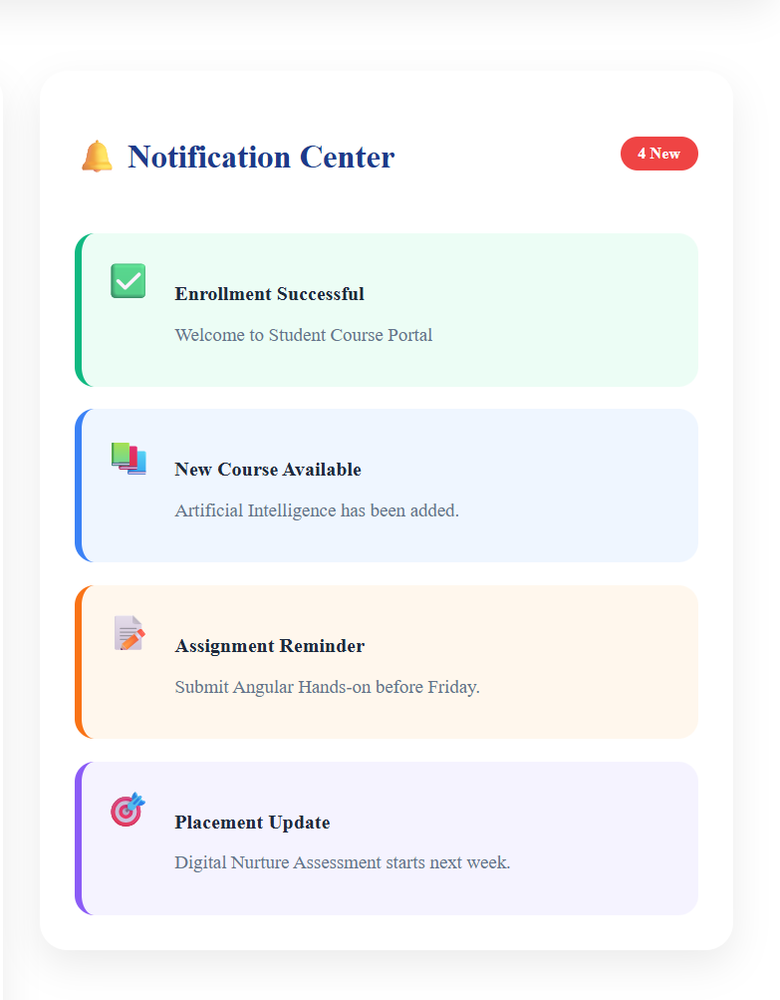

# 🎓 Student Course Portal

A modern Angular 20 Student Course Portal built as part of the Cognizant Digital Nurture 5.0 Program.

The application demonstrates modern Angular development including standalone components, routing, lazy loading, reactive forms, guards, pipes, directives, services, NgRx Store and responsive UI design.

---

# 📸 Screenshots

## Login



---

## Home Dashboard



---

## Courses



---

## Enrollment



---

## Student Profile



---

## Notification Center



---

# ✨ Features

- Professional Login Page
- Student Dashboard
- Course Listing
- Beautiful Course Cards
- Course Enrollment
- Reactive Enrollment Form
- Placement Readiness Dashboard
- Notification Center
- Student Profile
- Responsive Design
- Lazy Loading
- Angular Routing
- Route Guards
- HTTP Interceptors
- Pipes
- Directives
- Services
- NgRx Store
- Standalone Components

---

# 🛠 Tech Stack

- Angular 20
- TypeScript
- HTML5
- CSS3
- RxJS
- Angular Forms
- Angular Router
- NgRx Store

---

# 📂 Project Structure

```
src
│
├── app
│   ├── components
│   ├── pages
│   ├── services
│   ├── guards
│   ├── directives
│   ├── pipes
│   ├── interceptors
│   ├── store
│   ├── features
│   └── shared
```

---

# 🚀 Installation

Clone the repository

```bash
git clone https://github.com/Keerthanags01/Digital-Nurture-5.0.git
```

Go inside project

```bash
cd Angular/student-course-portal
```

Install packages

```bash
npm install
```

Run

```bash
ng serve
```

Visit

```
http://localhost:4200
```

---

# 📚 Angular Concepts Demonstrated

- Standalone Components
- Component Communication
- Data Binding
- Property Binding
- Event Binding
- Two-way Binding
- Routing
- Nested Routing
- Lazy Loading
- Guards
- Services
- Dependency Injection
- Pipes
- Directives
- Template Driven Forms
- Reactive Forms
- Custom Validators
- Async Validators
- HTTP Interceptors
- NgRx Store

---

# 🎯 Learning Outcome

This project was developed to strengthen practical knowledge of Angular through hands-on implementation of modern Angular architecture and UI development while completing the Cognizant Digital Nurture 5.0 program.

---

# 👩‍💻 Author

**Keerthana Sathish**

GitHub

https://github.com/Keerthanags01